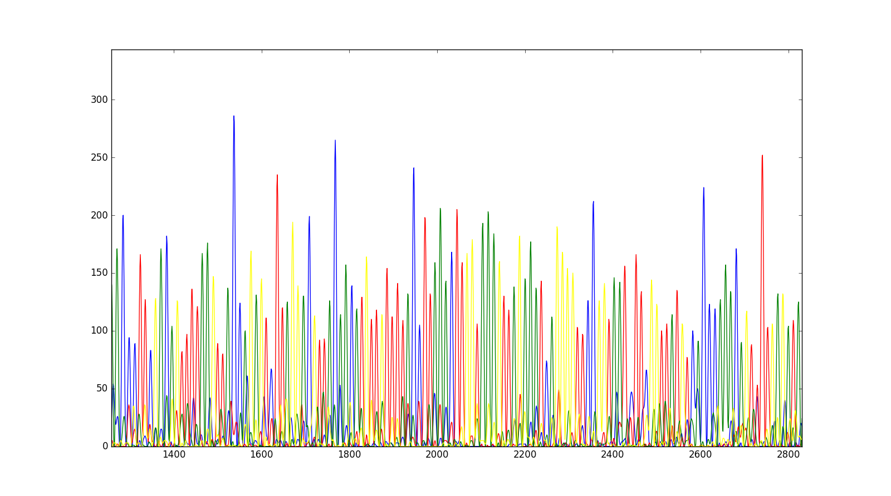

Problem
-------

ABI trace files can be useful to inspect. While there are ready-made solutions available, you may find yourself in a place where you need to write your own code to programmatically interact with the traces. Biopython allows us to do so.

Solution
--------

I show below an interactive IPython terminal session, using my own Sanger sequencing file, but it will work with other AB1 files.

Firstly, we read in the ABI file:

``` python
In [2]: from Bio import SeqIO

In [6]: record = SeqIO.read('55-Mn-fw-EM-28.ab1', 'abi')
```

The data that we are most interested in is in the annotations attribute of the record.

```python
In [7]: record.annotations.keys()
Out[7]: dict_keys(['dye', 'abif_raw', 'sample_well', 'run_finish', 'machine_model', 'run_start', 'polymer'])
```

Under `abif_raw` is another dictionary of data.

```python
In [9]: record.annotations['abif_raw'].keys()
Out[9]: dict_keys(['DATA5', 'DATA8', 'RUNT1', 'phAR1', 'DATA4', 'DATA3', 'RUNT4', 'LsrP1', 'ASPt2', 'CTNM1', 'RUND1', 'RPrN1', 'DATA10', 'InSc1', 'SPAC2', 'phCH1', 'LNTD1', 'phQL1', 'S/N%1', 'RUND2', 'APrV1', 'SVER2', 'HCFG2', 'DyeW3', 'PLOC2', 'P1AM1', 'PTYP1', 'PDMF1', 'FVoc1', 'FTab1', 'RMXV1', 'TUBE1', 'DATA11', 'Tmpr1', 'BCTS1', 'SCAN1', 'EVNT1', 'DATA12', 'RMdX1', 'PBAS1', 'APXV1', 'User1', 'CpEP1', 'EVNT2', 'P2BA1', 'DATA1', 'APrN1', 'RUNT3', 'DySN1', 'B1Pt1', 'CTTL1', 'SVER3', 'SPAC1', 'APrX1', 'DATA9', 'RGNm1', 'EVNT4', 'RUND3', 'RUNT2', 'MODL1', 'PCON1', 'GTyp1', 'DyeW4', 'phTR2', 'PCON2', 'P2AM1', 'CTID1', 'CTOw1', 'ASPF1', 'EPVt1', 'SPAC3', 'SMLt1', 'NOIS1', 'NAVG1', 'B1Pt2', 'MCHN1', 'Rate1', 'DyeN2', 'AUDT1', 'RunN1', 'CMNT1', 'DSam1', 'DyeN3', 'RMdN1', 'AEPt1', 'RMdV1', 'P1WD1', 'Scan1', 'Scal1', 'InVt1', 'DyeN1', 'HCFG4', 'HCFG3', 'EVNT3', 'LIMS1', 'RUND4', 'ASPt1', 'SMED1', 'DyeW1', 'DCHT1', 'LAST1', 'PXLB1', 'SMPL1', 'Dye#1', 'APFN2', 'LANE1', 'P1RL1', 'P2RL1', 'FWO_1', 'RPrV1', 'phDY1', 'SVER1', 'DATA2', 'HCFG1', 'NLNE1', 'PLOC1', 'phTR1', 'RGOw1', 'DyeW2', 'Feat1', 'ARTN1', 'PSZE1', 'BufT1', 'DATA7', 'PBAS2', 'DyeN4', 'MODF1', 'AEPt2', 'PDMF2', 'DATA6'])
```

According to the [ABI data specification](http://www.appliedbiosystem.com/support/software_community/ABIF_File_Format.pdf) (page 40), all of the data necessary for the traces that are conventionally displayed are in the `DATA9` through `DATA12` channels. We can grab these channels out programmatically. It isn't stated clearly, though, what letters correspond to which colour, and hence which exact channel.

```python
In [10]: channels = ['DATA9', 'DATA10', 'DATA11', 'DATA12']

In [13]: from collections import defaultdict

In [15]: trace = defaultdict(list)

In [16]: for c in channels:
    ...:     trace[c] = record.annotations['abif_raw'][c]
    ...:
```

Now, it's possible to plot them on a `matplotlib` figure.

```python
In [25]: plt.plot(trace['DATA9'], color='blue')
Out[25]: [<matplotlib.lines.Line2D at 0x10c956da0>]

In [26]: plt.plot(trace['DATA10'], color='red')
Out[26]: [<matplotlib.lines.Line2D at 0x10c8d7ac8>]

In [27]: plt.plot(trace['DATA11'], color='green')
Out[27]: [<matplotlib.lines.Line2D at 0x10c8f7908>]

In [28]: plt.plot(trace['DATA12'], color='yellow')
Out[28]: [<matplotlib.lines.Line2D at 0x10c96e128>]

In [29]: plt.show()
```

We will get the following trace, after zooming into a particular region.



Discussion
----------
As of current writing, this cookbook recipe didn't go further into computing metrics. One particular thing that may be interesting is to quantify the Shannon Diversity of mixed base calls vs. single base calls.
