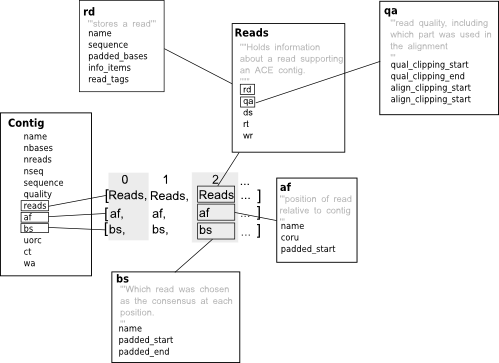

This page describes the **Contig** class used in **Bio.Sequencing.Ace**
to hold all of the information about a single contig record in an Ace
file.

A contig is a set of overlapping sequences used to generate a consensus
sequence for a given region of a genome. Ace files are usually used to
store contigs (that is a consensus sequence and the DNA sequences that
are used to generate it) created with
[phrap](http://www.phrap.org/phredphrapconsed.html) or as part of [454
sequencing projects](http://en.wikipedia.org/wiki/454_Life_Sciences).
Biopython's ace contig class follows the the structure ace file format
closely so if you are not familiar with these files (a description of
the format can be found under the heading "ACE FILE FORMAT" in the
[consed
readme](http://bozeman.mbt.washington.edu/consed/distributions/README.14.0.txt))
it might represent a steep learning curve - the diagram below gives an
overview of how some of the most important information is stored.

Summary Diagram
---------------



Examples
--------

``` python
#Start by parsing a file to get some contigs 
>>>from Bio.Sequencing import Ace
>>>ace_gen = Ace.parse(open("contig1.ace", 'r')) # from Tests/Ace/contig1.ace
>>>contig = ace_gen.next()

# just the consensus sequence
>>>contig.sequence
'aatacgGGATTGCCCTAGTAACGGCGAGTGAAGCGGCAACAGCTCAAATTTG......'
# assembler designated quality for each base in the consensus
>>>contig.quality
[0, 0, 0, 0, 0, 0, 22, 23, 25, 28, 34, 47,...]

# Ace files also contain information on the reads that make up the consensus.
# Information about the reads are in two lists, "reads" and "af"

# so, to get read sequence for every read in a contig
# and that reads position in its contig
>>>for i in range(len(contig.reads)):               
...     contig.af[i].padded_start           
...     contig.reads[i].rd.sequence
...                                
'tagcgaggaaagaacccaacaGg...'
-14  
'aatacgGGATTGCCCTagtaacG...'
1
```
