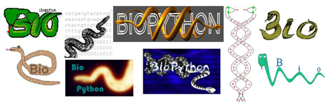

The new "Biopython" logo with yellow and blue snakes forming a double
helix was created by Patrick Kunzmann in 2017, and was first used in
Biopython release 1.70.

The logo is available in the sizes [XS](http://biopython.org/assets/images/biopython_logo_xs.png), [S](http://biopython.org/assets/images/biopython_logo_s.png), [M](http://biopython.org/assets/images/biopython_logo_m.png), [L](http://biopython.org/assets/images/biopython_logo_l.png) and as [vectorized image](http://biopython.org/assets/images/biopython_logo.svg).

This logo replaced the original logo, created by Henrik Vestergaard
and Thomas Hamelryck in 2003. Inspired by the structure of DNA, it
showed two golden pythons twisting in opposite directions to form a
double helix around the word Biopython:

As of Biopython release 1.50, we've included the logo on the front cover
of the [Biopython Tutorial and
Cookbook](http://biopython.org/DIST/docs/tutorial/Tutorial.html)
([PDF](http://biopython.org/DIST/docs/tutorial/Tutorial.pdf)), which had
previously been rather plain.

This design was chosen from panel of entries to an open competition on
the mailing lists back in [Summer
2003](http://lists.open-bio.org/pipermail/biopython/2003-June/001389.html).

This picture shows the nine entries for the competition (taken from
[Brad Chapman's BOSC 2003 talk](http://biopython.org/DIST/docs/presentations/bosc_biopython.pdf)):

