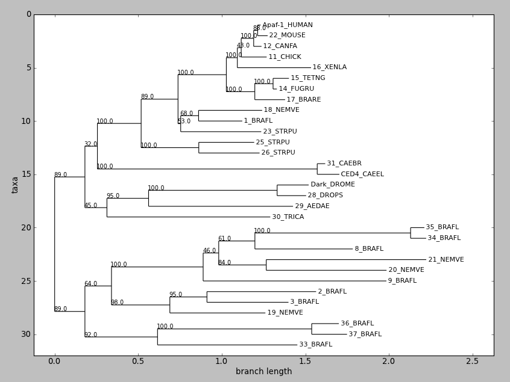
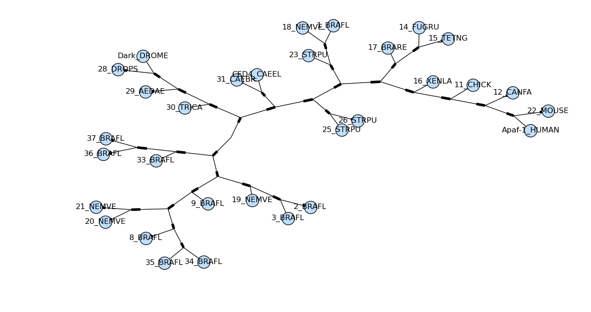
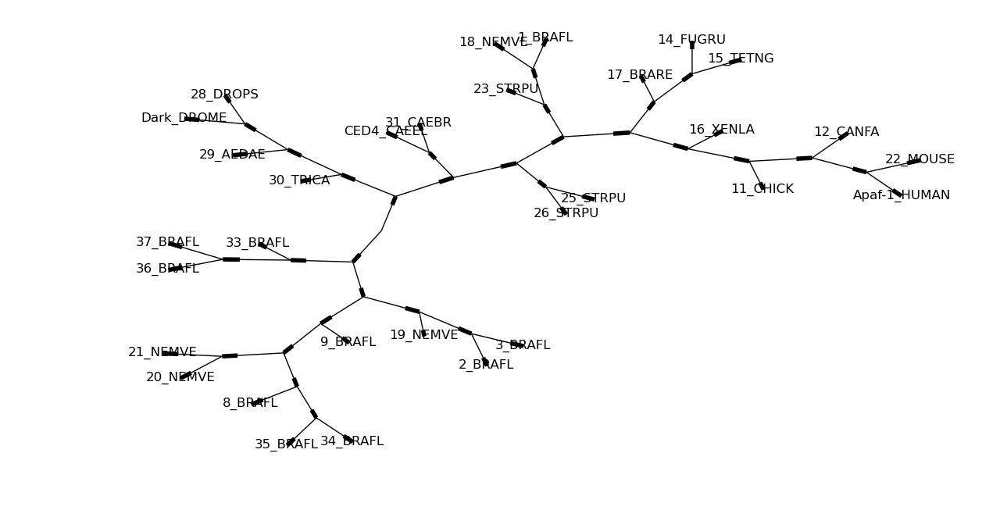

This module provides classes, functions and I/O support for working with
phylogenetic trees.

For more complete documentation, see the Phylogenetics chapter of the
[Biopython
Tutorial](http://biopython.org/DIST/docs/tutorial/Tutorial.html) and the
`Bio.Phylo` [API
pages](http://biopython.org/DIST/docs/api/Bio.Phylo-module.html)
generated from the source code. The [Phylo
cookbook](Phylo_cookbook "wikilink") page has more examples of how to
use this module, and the [PhyloXML](PhyloXML "wikilink") page describes
how to attach graphical cues and additional information to a tree.

Availability
------------

This module is included in Biopython 1.54 and later. If you're
interested in testing newer additions to this code before the next
official release, see [SourceCode](SourceCode "wikilink") for
instructions on getting a copy of the development branch.

To draw trees (optional), you'll also need these packages:

-   [Matplotlib](http://matplotlib.sourceforge.net/)
-   [NetworkX](http://networkx.github.io) -- for the function
    `to_networkx` (and deprecated function `draw_graphviz`)
-   [PyGraphviz](https://pygraphviz.github.io/) or
    [pydot](https://github.com/erocarrera/pydot) -- for the function
    `to_networkx` (and deprecated function `draw_graphviz`)

The I/O and tree-manipulation functionality will work without them;
they're imported on demand when the functions `draw()`, `draw_graphviz()`
and `to_networkx()` are called.

The `Phylo` module has also been successfully tested on Jython 2.5.1,
minus the Graphviz- and NetworkX-based functions. However, parsing
phyloXML files is noticeably slower because Jython uses a different
version of the underlying XML parsing library.

I/O functions
-------------

Wrappers for supported file formats are available from the top level of
the module:

``` python
from Bio import Phylo
```

Like [`SeqIO`](SeqIO "wikilink") and [`AlignIO`](AlignIO "wikilink"), this module
provides four I/O functions: `parse()`, `read()`, `write()` and `convert()`.
Each function accepts either a file name or an open file handle, so data can
be also loaded from compressed files, `StringIO` objects, and so on. If the
file name is passed as a string, the file is automatically closed when the function
finishes; otherwise, you're responsible for closing the handle yourself.

The second argument to each function is the target format. Currently,
the following formats are supported:

-   newick
-   nexus
-   nexml
-   phyloxml
-   cdao

See the [`PhyloXML`](PhyloXML "wikilink") page for more examples of using
tree objects.

### parse()

Incrementally parse each tree in the given file or handle, returning an
iterator of Tree objects (i.e. some subclass of the `Bio.Phylo.BaseTree`
Tree class, depending on the file format).

``` pycon
>>> trees = Phylo.parse("phyloxml_examples.xml", "phyloxml")
>>> for tree in trees:
...     print(tree.name)
...
example from Prof. Joe Felsenstein's book "Inferring Phylogenies"
example from Prof. Joe Felsenstein's book "Inferring Phylogenies"
same example, with support of type "bootstrap"
same example, with species and sequence
same example, with gene duplication information and sequence relationships
similar example, with more detailed sequence data
network, node B is connected to TWO nodes: AB and C
...
```

If there's only one tree, then the `next()` method on the resulting
generator will return it.

``` pycon
>>> tree = Phylo.parse('phyloxml_examples.xml', 'phyloxml').next()
>>> tree.name
'example from Prof. Joe Felsenstein\'s book "Inferring Phylogenies"'
```

Note that this doesn't immediately reveal whether there are any
remaining trees -- if you want to verify that, use `read()` instead.

### read()

Parse and return exactly one tree from the given file or handle. If the
file contains zero or multiple trees, a `ValueError` is raised. This is
useful if you know a file contains just one tree, to load that tree
object directly rather than through `parse()` and `next()`, and as a safety
check to ensure the input file does in fact contain exactly one
phylogenetic tree at the top level.

``` python
tree = Phylo.read("example.dnd", "newick")
print(tree)
```

If you have your tree data already loaded as a Python string, you can
parse it with the help of `StringIO` (in Python's standard library):

``` python
from cStringIO import StringIO

treedata = "(A, (B, C), (D, E))"
handle = StringIO(treedata)
tree = Phylo.read(handle, "newick")
```

In one line:

``` python
tree = Phylo.read(StringIO("(A, (B, C), (D, E))"), "newick")
```

The other I/O functions also can be used with `StringIO`.

(General tip: if you write to the `StringIO` object and want to re-read
the contents, you'll need to call the `seek(0)` method to move the
handle back to the start of the `StringIO` data -- the same as an open
file handle. See examples of this in the [unit tests for
`Phylo`](https://github.com/biopython/biopython/blob/master/Tests/test_Phylo.py)
in the Biopython source code.

### write()

Write a sequence of Tree objects to the given file or handle. Passing a
single Tree object instead of a list or iterable will also work (see,
`Phylo` is friendly).

``` python
tree1 = Phylo.read("example1.xml", "phyloxml")
tree2 = Phylo.read("example2.xml", "phyloxml")
Phylo.write([tree1, tree2], "example-both.xml", "phyloxml")
```

### convert()

Given two files (or handles) and two formats, both supported by
`Bio.Phylo`, convert the first file from the first format to the second
format, writing the output to the second file.

``` python
Phylo.convert("example.nhx", "newick", "example2.nex", "nexus")
```

### Sub-modules

Within the `Phylo` module are parsers and writers for specific file
formats, conforming to the basic top-level API and sometimes adding
additional features.

**PhyloXMLIO:** Support for the [phyloXML](http://www.phyloxml.org/)
format. See the [`PhyloXML`](PhyloXML "wikilink") page for details.

**NeXMLIO:** Support for the [NeXML](http://www.nexml.org/) format.

**NewickIO:** A port of the parser in `Bio.Nexus.Trees` to support the
Newick (a.k.a. New Hampshire) format through the Phylo API.

**NexusIO:** Wrappers around `Bio.Nexus` to support the Nexus tree format.

**CDAOIO:** Support for the Comparative Data Analysis Ontology (CDAO).
Requires [RDFlib](https://github.com/RDFLib/rdflib).

The Nexus format actually contains several sub-formats for different
kinds of data; to represent trees, Nexus provides a block containing
some metadata and one or more Newick trees (another kind of Nexus block
can represent alignments; this is handled in
[`AlignIO`](AlignIO "wikilink"). So to parse a complete Nexus file with
all block types handled, use `Bio.Nexus` directly, and to extract just the
trees, use `Bio.Phylo`.

Tree and Subtree classes
------------------------

The basic objects are defined in `Bio.Phylo.BaseTree`.

### Format-specific extensions

To support additional information stored in specific file formats,
sub-modules within Tree offer additional classes that inherit from
`BaseTree` classes.

Each sub-class of `BaseTree.Tree` or `Node` has a class method to promote an
object from the basic type to the format-specific one. These sub-class
objects can generally be treated as instances of the basic type without
any explicit conversion.

**PhyloXML**: Support for the phyloXML format. See the
[`PhyloXML`](PhyloXML "wikilink") page for details.

**Newick**: The Newick module provides minor enhancements to the
`BaseTree` classes, plus several shims for compatibility with the existing
`Bio.Nexus` module. The API for this module is under development and
should not be relied on, other than the functionality already provided
by `BaseTree`.

Utilities
---------

Some additional tools are located in the `Utils` module under `Bio.Phylo`.
These functions are also loaded to the top level of the `Phylo` module on
import for easy access.

Where a third-party package is required, that package is imported when
the function itself is called, so these dependencies are not necessary
to install or use the rest of the Tree module.

### Displaying trees

`str(tree)` produces a plain-text representation of the entire
tree. Strings are automatically truncated to ensure reasonable display.

Use this with the print function to get a quick overview of your tree:

``` pycon
>>> tree = Phylo.parse('phyloxml_examples.xml', 'phyloxml').next()
>>> print(tree)
Phylogeny(description='phyloXML allows to use either a "branch_length"
attribute or element to indicate branch lengths.', name='example from
Prof. Joe Felsenstein s book "Inferring Phylogenies"')
    Clade()
        Clade(branch_length=0.06)
            Clade(branch_length=0.102, name='A')
            Clade(branch_length=0.23, name='B')
        Clade(branch_length=0.4, name='C')
...
```


`draw()` displays a rooted phylogram using Matplotlib or Pylab. *New in
Biopython 1.58.*

Try this:

``` python
tree = Phylo.read("apaf.xml", "phyloxml")
tree.ladderize()  # Flip branches so deeper clades are displayed at top
Phylo.draw(tree)
```

`draw_graphviz` mimics the networkx function of the same name, with
some tweaks to improve the display of the graph. If a file name is
given, the graph is drawn directly to that file, and options such as
image format (default PDF) may be used.



Sadly the plot `draw_graphviz` draws is misleading, so we have deprecated
this method. The branch lengths are ignored and the distances between nodes
in the plot is arbitrary, per the graphviz layout engine. But it looks like
a proper radial phylogeny at first glance, which could lead to a wrong
interpretation of the data. It would be better for users to create radial
plots with another library like ETE or DendroPy, or just use the simple
rectangular plot produced by Phylo.draw.

Prerequisites: In addition to NetworkX, you'll need a local installation
of Graphviz, [Matplotlib](http://matplotlib.sourceforge.net/) and either
[PyGraphviz](https://pygraphviz.github.io/) or
[pydot](https://github.com/erocarrera/pydot).

Drawing a basic dendrogram is simple:

``` python
import pylab

tree = Phylo.read("apaf.xml", "phyloxml")
Phylo.draw_graphviz(tree)
pylab.show()
```



Here's the same tree without the circles at each labelled node:

``` python
Phylo.draw_graphviz(tree, node_size=0)
```

See the [Phylo cookbook](Phylo_cookbook "wikilink") page for more
drawing features and options.

`draw_ascii` prints an ascii-art rooted phylogram to standard output,
or another file handle if specified. Only terminal node labels are
shown; these are the result of `str(clade)` (usually clade names). The
width of the text field used for drawing is 80 characters by default,
adjustable with the `column_width` keyword argument, and the height in
character rows is twice the number of terminals in the tree.

A simple tree with defined branch lengths looks like this:

    >>> tree = Phylo.parse('phyloxml_examples.xml', 'phyloxml').next()
    >>> Phylo.draw_ascii(tree)
              _____________ A
      _______|
    _|       |_______________________________ B
     |
     |_______________________________________________________ C

The same topology without branch lengths is drawn with equal-length
branches:

                                  ___________________________ A
      ___________________________|
    _|                           |___________________________ B
     |
     |___________________________ C

A larger tree (apaf.xml, 31 leaf nodes) drawn with the default column
width demonstrates how relatively short branches are handled:

    >>> apaf = Phylo.read('apaf.xml', 'phyloxml')
    >>> Phylo.draw_ascii(apaf)
                                       _ 22_MOUSE
                                      |
                                     _| Apaf-1_HUMAN
                                    | |
                                   ,| | 12_CANFA
                                   ||
                                  _||___ 11_CHICK
                                 | |
                                 | |___________ 16_XENLA
                          _______|
                         |       |       , 14_FUGRU
                         |       |     __|
                         |       |____|  |__ 15_TETNG
                    _____|            |
                   |     |            |____ 17_BRARE
                   |     |
                   |     |    ______ 1_BRAFL
                   |     | __|
             ______|     ||  |_________ 18_NEMVE
            |      |      |
            |      |      |____________ 23_STRPU
            |      |
           _|      |          _________ 26_STRPU
          | |      |_________|
          | |                |________ 25_STRPU
          | |
          | |                                    ___ CED4_CAEEL
          | |___________________________________|
      ____|                                     |_ 31_CAEBR
     |    |
     |    |                                ___ 28_DROPS
     |    |          _____________________|
     |    |   ______|                     |____ Dark_DROME
     |    |  |      |
     |    |__|      |_______________________ 29_AEDAE
     |       |
     |       |__________________________ 30_TRICA
     |
     |                                                           _ 34_BRAFL
     |                                 _________________________|
    _|                           _____|                         |_ 35_BRAFL
     |                          |     |
     |                        __|     |_______________ 8_BRAFL
     |                       |  |
     |                       |  |        ___________________ 20_NEMVE
     |         ______________|  |_______|
     |        |              |          |__________________________ 21_NEMVE
     |        |              |
     |     ___|              |______________________________ 9_BRAFL
     |    |   |
     |    |   |                _____________ 3_BRAFL
     |    |   |          _____|
     |    |   |_________|     |_________________ 2_BRAFL
     |____|             |
          |             |_______________ 19_NEMVE
          |
          |                                     _____ 37_BRAFL
          |            ________________________|
          |___________|                        |____ 36_BRAFL
                      |
                      |______________________ 33_BRAFL

### Exporting to other object representations

Although any phylogenetic tree can reasonably be represented by a
directed acyclic graph, the `Phylo` module does not attempt to provide a
generally usable graph library -- only the minimum functionality to
represent phylogenetic trees. Instead, it provides functions for
exporting Tree objects to the standard graph representations, adjacency
list (dict) and adjacency matrix, using third-party libraries.

`to_networkx` returns the given tree as a
[NetworkX](http://networkx.github.io) `LabeledDiGraph` or `LabeledGraph`
object (depending on whether the tree is rooted). You'll probably need
to import NetworkX directly for subsequent operations on the graph
object. From this point you can also try using one of NetworkX's drawing
functions to display the tree, and for simple, fully labeled trees it
may even work -- but you'll have better results with Phylo's own
`draw_graphviz` function, discussed above.

``` python
import networkx, pylab

tree = Phylo.read("example.xml", "phyloxml")
net = Phylo.to_networkx(tree)
networkx.draw(net)
pylab.show()
```

Recipes for exporting to other libraries, including **ape** (via Rpy2)
and **PyCogent**, are available on the [Phylo
cookbook](Phylo_cookbook "wikilink") page.

Upcoming GSoC 2013 features
---------------------------

Many new features for building and processing phylogenetic trees were
developed by Yanbo Ye for [Google Summer of
Code](Google_Summer_of_Code "wikilink") 2013. They are available on the
development branch (see [SourceCode](SourceCode "wikilink")) but are not
yet included in an official Biopython release version. Note that the
behavior and API of these features may change before the upcoming
official release.

### Tree Construction

In addition to wrappers of tree construction programs (PHYLIP programs
through EMBOSS wrappers in `Bio.Emboss.Applications`), now Biopython also
provides several tree construction algorithm implementations in pure
python in the `Bio.Phylo.TreeConstruction` module.

All algorithms are designed as worker subclasses of a base class
`TreeConstructor`. All constructors have the same method `build_tree`
that accept a `MultipleSeqAlignment` object to construct the tree.
Currently there are two types of tree constructors:
`DistanceTreeConstructor` and `ParsimonyTreeConstructor`.

#### DistanceTreeConstructor

The `DistanceTreeConstructor` has two algorithms: UPGMA (Unweighted Pair
Group Method with Arithmetic Mean) and NJ (Neighbor Joining).

Both algorithms construct trees based on a distance matrix. So before
using these algorithms, let me introduce the `DistanceCalculator` to
generate the distance matrix from a `MultipleSeqAlignment` object. The
following code shows a common way to do this:

``` pycon
>>> from Bio.Phylo.TreeConstruction import DistanceCalculator
>>> from Bio import AlignIO
>>> aln = AlignIO.read('Tests/TreeConstruction/msa.phy', 'phylip')
>>> print(aln)
Alignment with 5 rows and 13 columns
AACGTGGCCACAT Alpha
AAGGTCGCCACAC Beta
GAGATTTCCGCCT Delta
GAGATCTCCGCCC Epsilon
CAGTTCGCCACAA Gamma
>>> calculator = DistanceCalculator('identity')
>>> dm = calculator.get_distance(aln)
>>> dm
DistanceMatrix(names=['Alpha', 'Beta', 'Gamma', 'Delta', 'Epsilon'], matrix=[[0], [0.23076923076923073, 0], [0.3846153846153846, 0.23076923076923073, 0], [0.5384615384615384, 0.5384615384615384, 0.5384615384615384, 0], [0.6153846153846154, 0.3846153846153846, 0.46153846153846156, 0.15384615384615385, 0]])
>>> print(dm)
Alpha   0
Beta    0.230769230769  0
Gamma   0.384615384615  0.230769230769  0
Delta   0.538461538462  0.538461538462  0.538461538462  0
Epsilon 0.615384615385  0.384615384615  0.461538461538  0.153846153846  0
    Alpha   Beta    Gamma   Delta   Epsilon
```

As you see, we create a `DistanceCalculator` object with a string
'identity', which is the name of the model (scoring matrix) to calculate
the distance. The 'identity' model is the default one and can be used
both for DNA and protein sequences. To check available models for DNA,
protein or all, use the attribute of the calculator `dna_models`,
`protein_models`, `models` respectively.

After the calculator is created with the model, simply use the
`get_distance()` method to get the distance matrix of a given alignment
object. Then you will get a `DistanceMatrix` object, a subclass of
`Matrix`(we will talk about this later).

Now, let's get back to the `DistanceTreeConstructor`. We can pass the
`DistanceCalculator` object and a string parameter('nj' or 'upgma') to
initialize it, and then call its `build_tree()` as mentioned before.

``` pycon
>>> from TreeConstruction import DistanceTreeConstructor
>>> constructor = DistanceTreeConstructor(calculator, 'nj')
>>> tree = constructor.build_tree(aln)
>>> print(tree)
Tree(rooted=False)
    Clade(branch_length=0, name='Inner3')
        Clade(branch_length=0.182692307692, name='Alpha')
        Clade(branch_length=0.0480769230769, name='Beta')
        Clade(branch_length=0.0480769230769, name='Inner2')
            Clade(branch_length=0.278846153846, name='Inner1')
                Clade(branch_length=0.0512820512821, name='Epsilon')
                Clade(branch_length=0.102564102564, name='Delta')
            Clade(branch_length=0.144230769231, name='Gamma')
```

While sometimes you might want to use your own `DistanceMatrix` directly
instead of the raw alignment, we provide another direct way to use both
algorithms.

``` pycon
>>> from TreeConstruction import DistanceTreeConstructor
>>> constructor = DistanceTreeConstructor()
>>> tree = constructor.nj(dm)
>>> print(tree)
Tree(rooted=False)
    Clade(branch_length=0, name='Inner3')
        Clade(branch_length=0.182692307692, name='Alpha')
        Clade(branch_length=0.0480769230769, name='Beta')
        Clade(branch_length=0.0480769230769, name='Inner2')
            Clade(branch_length=0.278846153846, name='Inner1')
                Clade(branch_length=0.0512820512821, name='Epsilon')
                Clade(branch_length=0.102564102564, name='Delta')
            Clade(branch_length=0.144230769231, name='Gamma')
>>> tree = constructor.upgma(dm)
>>> print(tree)
Tree(rooted=True)
    Clade(branch_length=0, name='Inner4')
        Clade(branch_length=0.1875, name='Inner1')
            Clade(branch_length=0.0769230769231, name='Epsilon')
            Clade(branch_length=0.0769230769231, name='Delta')
        Clade(branch_length=0.110576923077, name='Inner3')
            Clade(branch_length=0.0384615384615, name='Inner2')
                Clade(branch_length=0.115384615385, name='Gamma')
                Clade(branch_length=0.115384615385, name='Beta')
            Clade(branch_length=0.153846153846, name='Alpha')
```

#### ParsimonyTreeConstructor

Unlike `DistanceTreeConstructor`, the concrete algorithm of
`ParsimonyTreeConstructor` is delegated to two different worker classes:
the `ParsimonyScorer` to calculate the parsimony score of a target tree
by the given alignment, and the `TreeSearcher` to search the best tree
that minimize the parsimony score. A typical usage example can be as
follows:

``` pycon
>>> from Bio import AlignIO
>>> from TreeConstruction import *
>>> aln = AlignIO.read(open('Tests/TreeConstruction/msa.phy'), 'phylip')
>>> starting_tree = Phylo.read('Tests/TreeConstruction/nj.tre', 'newick')
>>> scorer = ParsimonyScorer()
>>> searcher = NNITreeSearcher(scorer)
>>> constructor = ParsimonyTreeConstructor(searcher, starting_tree)
>>> pars_tree = constructor.build_tree(aln)
>>> print(pars_tree)
Tree(weight=1.0, rooted=True)
    Clade(branch_length=0.0)
        Clade(branch_length=0.197335, name='Inner1')
            Clade(branch_length=0.13691, name='Delta')
            Clade(branch_length=0.08531, name='Epsilon')
        Clade(branch_length=0.041935, name='Inner2')
            Clade(branch_length=0.01421, name='Inner3')
                Clade(branch_length=0.17523, name='Gamma')
                Clade(branch_length=0.07477, name='Beta')
            Clade(branch_length=0.29231, name='Alpha')
```

The `ParsimonyScorer` is a combination of the Fitch algorithm and
Sankoff algorithm. It will work as Fitch algorithm by default if no
parameter is provide, and work as Sankoff algorithm if a parsimony
scoring matrix (a `Matrix` object) is given.

Then the scorer is passed to a `TreeSearcher` to tell it how to evaluate
different trees during searching. Currently, only one searcher
`NNITreeSearcher`, the Nearest Neighbor Interchange (NNI) algorithm, is
implemented.

By passing the searcher and a starting tree to the
`ParsimonyTreeConstructor`, we finally get the instance of it. If no
starting tree is provided, a simple upgma tree will be created instead,
with the 'identity' model. To use this parsimony constructor, just
simply call the `build_tree` method with an alignment.

### Consensus Tree

#### Strict, Majority Rule and Adam Consensus

Same as tree construction algorithms, three consensus tree
algorithms(Strict, Majority Rule and Adam Consensus) in pure python are
also implemented in the `Bio.Phylo.Consensus` module. You can directly
call `strict_consensus`, `majority_consensus` and `adam_consensus` to
use these algorithms with a list of trees as the input.

``` python
from Bio import Phylo
from Bio.Phylo.Consensus import *

trees = list(Phylo.parse("Tests/TreeConstruction/trees.tre", "newick"))
strict_tree = strict_consensus(trees)
majority_tree = majority_consensus(trees, 0.5)
adam_tree = adam_consensus(trees)
```

Instead of using 50% as the cutoff, the `majority_consensus` method
allows you to set your own one by providing an extra `cutoff`
parameter(0~1, 0 by default). That means it can also work as strict
consensus algorithm when the `cutoff` equals 1. One more thing different
to strict and adam consensus tree, the result majority rule consensus
tree has branch support value that are automatically assigned during
calculation.

#### Bootstrap Methods

To get the consensus tree, we must construct a list of bootstrap
replicate trees. So in the `Bio.Phylo.Consensus` module, we also provide
several useful bootstrap methods to achieve this.

``` python
from Bio import Phylo
from Bio.Phylo.Consensus import *

msa = AlignIO.read("Tests/TreeConstruction/msa.phy", "phylip")
msas = bootstrap(msa, 100)
```

As you see, the `bootstrap` method accepts a `MultipleSeqAlignment`
object and generates its bootstrap replicate 100 times. The you can use
them to build replicate trees. While, we also provide a convenient
method to do this.

``` python
calculator = DistanceCalculator("blosum62")
constructor = DistanceTreeConstructor(calculator)
trees = bootstrap_trees(msa, 100, constructor)
```

This time we pass an extra `DistanceTreeConstructor` object to a
`bootstrap_trees` method and finally got the replicate trees. Note that
both `bootstrap` and `bootstrap_trees` are generator functions. You need
to use `list()` function to turn the result into a list of alignment or
trees.

Another useful function is `bootstrap_consensus`. By passing the
consensus method as another extra parameter, we can directly get the
consensus tree.

``` python
consensus_tree = bootstrap_consensus(msa, 100, constructor, majority_consensus)
```

#### Branch Support

To get the branch support of a specific tree, we can use the
`get_support` method.

``` python
from Bio import Phylo
from Bio.Phylo.Consensus import *

trees = list(Phylo.parse("Tests/TreeConstruction/trees.tre", "newick"))
target_tree = trees[0]
support_tree = get_support(target_tree, trees)
```

In the above code, we use the first tree as the target tree that we want
to calculate its branch support. The `get_support` method accepts the
target tree and a list of trees, and returns a tree, with all internal
clades assigned with branch support values.

### Other Useful Classes

There are some other classes in both `TreeConstruction` and `Consensus`
module that are used in those algorithms. They may not be used commonly,
but might be useful to you in some cases.

#### \_Matrix

The `_Matrix` class in the `TreeConstruction` module is the super class
of `_DistanceMatrix`. They are both actually constructed by a list of
names and a nested list of numbers in lower triangular matrix format.
The only difference between them is that the diagonal elements in
`_DistanceMatrix` will all be 0 no matter what values are assigned.

To create a `_Matrix` object:

``` pycon
>>> from Bio.Phylo.TreeConstruction import _Matrix
>>> names = ['Alpha', 'Beta', 'Gamma', 'Delta']
>>> matrix = [[0], [1, 0], [2, 3, 0], [4, 5, 6, 0]]
>>> m = _Matrix(names, matrix)
>>> m
_Matrix(names=['Alpha', 'Beta', 'Gamma', 'Delta'], matrix=[[0], [1, 0], [2, 3, 0], [4, 5, 6, 0]])
>>> print(m)
Alpha   0
Beta    1   0
Gamma   2   3   0
Delta   4   5   6   0
    Alpha   Beta    Gamma   Delta
```

You can use two indices to get or assign an element in the matrix, and
the indices are exchangeable.

``` pycon
>>> m[1,2]
3
>>> m[2,1]
3
>>> m['Beta','Gamma']
3
>>> m['Beta','Gamma'] = 4
>>> m['Beta','Gamma']
4
```

Further more, you can use one index to get or assign a list of elements
related to that index:

``` pycon
>>> m[0]
[0, 1, 2, 4]
>>> m['Alpha']
[0, 1, 2, 4]
>>> m['Alpha'] = [0, 7, 8, 9]
>>> m[0]
[0, 7, 8, 9]
>>> m[0,1]
7
```

Also you can delete or insert a column&row of elements by index:

``` pycon
>>> m
_Matrix(names=['Alpha', 'Beta', 'Gamma', 'Delta'], matrix=[[0], [7, 0], [8, 4, 0], [9, 5, 6, 0]])
>>> del m['Alpha']
>>> m
_Matrix(names=['Beta', 'Gamma', 'Delta'], matrix=[[0], [4, 0], [5, 6, 0]])
>>> m.insert('Alpha', [0, 7, 8, 9] , 0)
>>> m
_Matrix(names=['Alpha', 'Beta', 'Gamma', 'Delta'], matrix=[[0], [7, 0], [8, 4, 0], [9, 5, 6, 0]])
```

#### \_BitString

`_BitString` is an assistant class used frequently in the algorithms in
the `Consensus` module. It's a sub-class of `str` object that only
accepts two characters ('0' and '1'), with additional functions for
binary-like manipulation (& | ^ ~). Common usage is as follows:

``` pycon
>>> from Bio.Phylo.Consensus import _BitString
>>> bitstr1 = _BitString('11111')
>>> bitstr2 = _BitString('11100')
>>> bitstr3 = _BitString('01101')
>>> bitstr1
_BitString('11111')
>>> bitstr2 &amp; bitstr3
_BitString('01100')
>>> bitstr2 | bitstr3
_BitString('11101')
>>> bitstr2 ^ bitstr3
_BitString('10001')
>>> bitstr2.index_one()
[0, 1, 2]
>>> bitstr3.index_one()
[1, 2, 4]
>>> bitstr3.index_zero()
[0, 3]
>>> bitstr1.contains(bitstr2)
True
>>> bitstr2.contains(bitstr3)
False
>>> bitstr2.independent(bitstr3)
False
>>> bitstr2.independent(bitstr4)
True
>>> bitstr1.iscompatible(bitstr2)
True
>>> bitstr2.iscompatible(bitstr3)
False
>>> bitstr2.iscompatible(bitstr4)
True
```

In consensus and branch support algorithms, it is used to count and
store the clades in multiple trees. During counting, the clades will be
considered the same if their terminals (in terms of `name` attribute) are
the same.

For example, let's say two trees are provided as below to search their
strict consensus tree:

```
tree1: (((A, B), C),(D, E))
tree2: ((A, (B, C)),(D, E))
```

For both trees, a `_BitString` object '11111' will represent their root
clade. Each '1' stands for the terminal clade in the list \[A, B, C, D,
E\] (the order might not be the same, it's determined by the
`get_terminal` method of the first tree provided). For the clade ((A,
B), C) in tree1 and (A, (B, C)) in tree2, they both can be represented
by '11100'. Similarly, '11000' represents clade (A, B) in tree1, '01100'
represents clade (B, C) in tree2, and '00011' represents clade (D, E) in
both trees.

So, with the `_count_clades` function in this module, finally we can get
the clade counts and their `_BitString` representation as follows (the
root and terminals are omitted):

    clade   _BitString   count
    ABC     '11100'     2
    DE      '00011'     2
    AB      '11000'     1
    BC      '01100'     1

To get the `_BitString` representation of a clade, we can use the
following code snippet:

``` python
# suppose we are provided with a tree list, the first thing
# to do is to get all the terminal names in the first tree
term_names = [term.name for term in trees[0].get_terminals()]

# for a specific clade in any of the tree, also get its terminal names
clade_term_names = [term.name for term in clade.get_terminals()]

# then create a boolean list
boolvals = [name in clade_term_names for name in term_names]

# create the string version and pass it to _BitString
bitstr = _BitString("".join(map(str, map(int, boolvals))))
```

To convert back:

``` python
# get all the terminal clades of the first tree
terms = [term for term in trees[0].get_terminals()]

# get the index of terminal clades in bitstr
index_list = bitstr.index_one()

# get all terminal clades by index
clade_terms = [terms[i] for i in index_list]

# create a new calde and append all the terminal clades
new_clade = BaseTree.Clade()
new_clade.clades.extend(clade_terms)
```

This is how the `_BitString` is used in the consensus and branch support
algorithms. And I think it can be used in many other conditions.

For example, we can even use it to check whether the structures of two
trees are the same.

``` python
# store and return all _BitStrings
def _bitstrs(tree):
    bitstrs = set()
    term_names = [term.name for term in tree.get_terminals()]
    term_names.sort()
    for clade in tree.get_nonterminals():
        clade_term_names = [term.name for term in clade.get_terminals()]
        boolvals = [name in clade_term_names for name in term_names]
        bitstr = _BitString("".join(map(str, map(int, boolvals))))
        bitstrs.add(bitstr)
    return bitstrs


def compare(tree1, tree2):
    term_names1 = [term.name for term in tree1.get_terminals()]
    term_names2 = [term.name for term in tree2.get_terminals()]
    # false if terminals are not the same
    if set(term_names1) != set(term_names2):
        return False
    # true if _BitStrings are the same
    if _bitstrs(tree1) == _bitstrs(tree2):
        return True
    else:
        return False
```

To use it:

``` pycon
>>> tree1 = Phylo.read('Tests/TreeConstruction/upgma.tre', 'newick')
>>> tree2 = Phylo.read('Tests/TreeConstruction/nj.tre', 'newick')
>>> tree3 = Phylo.read('Tests/TreeConstruction/pars1.tre', 'newick')
>>> compare(tree1, tree2)
False
>>> compare(tree1, tree3)
True
>>> compare(tree2, tree3)
False
```

External Applications
---------------------

-   Bio.Phylo.PhymlCommandline provides a wrapper for
    [PhyML](http://www.atgc-montpellier.fr/phyml/) following the usual
    Bio.Applications API.
-   Bio.Phylo.[PAML](PAML "wikilink") provides wrappers, parsers and
    utilities for working with the PAML suite of programs.

Example pipeline
----------------

See the [Biopython
Tutorial](http://biopython.org/DIST/docs/tutorial/Tutorial.html)
sections on sequence alignment and BLAST for explanations of the first
few steps shown here.

1.  Search for homologs of a protein sequence using BLAST.

    ``` python
    from Bio.Blast import NBCIStandalone, NCBIXML

    query_fname = "AAG35789.fasta"
    result_handle, error_handle = NCBIStandalone.blastall(
        "/usr/bin/blastall", "blastp", "/db/fasta/swissprot", query_fname
    )
    blast_record = NCBIXML.read(result_handle)  # This takes some time to run
    ```

2.  Extract the best hits from the BLAST result.

    ``` python
    from Bio import SeqIO
    from Bio.Seq import Seq
    from Bio.SeqRecord import SeqRecord


    def get_seqrecs(alignments, threshold):
        for aln in alignments:
            for hsp in aln.hsps:
                if hsp.expect < threshold:
                    yield SeqRecord(Seq(hsp.sbjct), id=aln.accession)
                    break


    best_seqs = get_seqrecs(blast_record.alignments, 1e-90)
    SeqIO.write(best_seqs, "egfr-family.fasta", "fasta")
    ```

    To help with annotating to your tree later, pick a lookup key here (e.g.
    accession number) and build a dictionary mapping that key to any
    additional data you can glean from the BLAST output, such as taxonomy
    and GI numbers. In this example, we're only keeping the original
    sequence and accession number.

3.  Re-align the sequences using Muscle. The program creates an alignment
    file in Clustal format, "egfr-family.aln".

    ``` python
    from Bio.Align.Applications import MuscleCommandline

    cmdline = MuscleCommandline(input="egfr-family.fasta", out="efgr-family.aln", clw=True)
    cmdline()
    ```

4.  Infer a gene tree using PhyML. First, convert the alignment from step
    3 to "relaxed Phylip" format (new in Biopython 1.58):

    ``` python
    from Bio import AlignIO

    AlignIO.convert("egfr-family.aln", "clustal", "egfr-family.phy", "phylip-relaxed")
    ```

    Feed the alignment to PhyML using the command line wrapper:

    ``` python
    from Bio.Phylo.Applications import PhymlCommandline

    cmdline = PhymlCommandline(
        input="egfr-family.phy", datatype="aa", model="WAG", alpha="e", bootstrap=100
    )
    out_log, err_log = cmdline()
    ```

5.  Load the gene tree with Phylo, and take a quick look at the topology.
    (PhyML writes the tree to a file named after the input file plus
    "\_phyml\_tree.txt".)

    ``` python
    from Bio import Phylo

    egfr_tree = Phylo.read("egfr-family.phy_phyml_tree.txt", "newick")
    Phylo.draw_ascii(egfr_tree)
    ```

6.  Add accession numbers and sequences to the tree -- now we're using
    [PhyloXML](PhyloXML "wikilink")'s extra features.

    ``` python
    from Bio.Phylo import PhyloXML

    # Promote the basic tree to PhyloXML
    egfr_phy = egfr_tree.as_phyloxml()

    # Make a lookup table for sequences
    lookup = dict((rec.id, str(rec.seq)) for rec in best_seqs)

    for clade in egfr_phy.get_terminals():
        key = clade.name
        accession = PhyloXML.Accession(key, "NCBI")
        mol_seq = PhyloXML.MolSeq(lookup[key], is_aligned=True)
        sequence = PhyloXML.Sequence(type="aa", accession=accession, mol_seq=mol_seq)
        clade.sequences.append(sequence)

    # Save the annotated phyloXML file
    Phylo.write(egfr_phy, "egfr-family-annotated.xml", "phyloxml")
    ```
